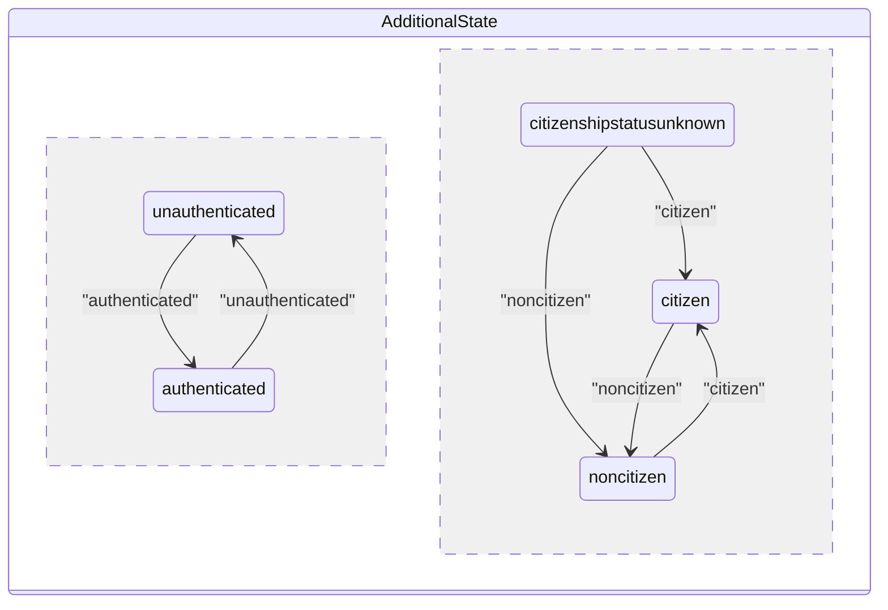

# Defining an Abstraction for Application Flows as Pushdown Automata

## Context

We've previously been using finite state machines to represent application flows. This has provided a number of benefits:

1. Provides a declarative way to define page transitions, which reduces bugs by constraining what is possible to a less expressive language
2. Provides a core data structure that can be augmented with additional functionality, such as visualization

Implementation-wise, we've been using the [xstate library](https://xstate.js.org/).

## Problem

Finite state machines have a number of limitations in theory and in practice.

**Reliance on external state**
Our use of finite state machines relies on external state that was pass in as context, and is used during calculation of state transitions. Relying on external state breaks the state machine abstraction and prevents the state machine from being self-contained description of the application flow. This isn't an inherent limitation of state machines, but it is an issue with our implementation approach. Later we will present a proposal to internalize this external state.

**Inability to capture nested flows**
Finite state machines aren't able to capture nested flows. Examples of nested flows include:

1. A non-logged in user clicks on a link to a page that requires them to be logged in. They are routed to the authentication flow before proceeding to the logged in page.
2. A user wants to change their password or some other sensitive information. In order to do so, they are first routed to the authentication flow, which itself may be a multi-page flow including username/password authentication as well as an MFA challenge. At the end of the authentication flow, the user gets to proceed to the next step of the flow.
3. A user is on a task list page for an online application for benefits. Example tasks are: verify your identity or enter information about your household. Each task is a multi-page series of steps. A user clicking into the task is routed to the task flow, and at the end is routed back to the task list page. However, the task flow can also be routed to from the review, sign, and submit page. If the user goes to the flow from there, they should be routed back to the review, sign, and submit page instead.

## Idea

We could consider using [pushdown automata](https://en.wikipedia.org/wiki/Pushdown_automaton) instead of finite state machines to represent application flows. Pushdown automata are strictly more expressive than finite state machines, yet less expressive than Turing machines.

Let's illustrate with an example. Suppose we're building a leave application. We'll need login pages `/auth/login` and `/auth/mfa`. We'll also have an application page `/application` that is a task list page that can go to an identity verification flow with that has two ways of verifying identity based on whether the user is a citizen or not `/application/verifyid/name`, `/application/verifyid/citizenshipstatus`, `/application/verifyid/citizen`, `/application/verifyid/noncitizen`. Then we can have a review, sign, and submit step at the end `/application/review`.

We can represent the states like

```mermaid
stateDiagram-v2
  state Flows {
    [*] --> /auth/login,unauthenticated
    /auth/login,unauthenticated --> /auth/mfa,unauthenticated
    /auth/mfa,unauthenticated --> [*]: emit "authenticated" event \n pop route \n go to popped route
    --
    [*] --> /application
    /application --> /verifyid: push /application
    /application --> /review
    /review --> /verifyid: push /review
    /review --> [*]
    --
    [*] --> /verifyid/name
    /verifyid/name --> /verifyid/citizenshipstatus
    state citizenshipstatus <<choice>>
    /verifyid/citizenshipstatus --> citizenshipstatus: emit "citizen" or "noncitizen" event
    citizenshipstatus --> /verifyid/citizen: /verifyid/citizenshipstatus,citizen
    citizenshipstatus --> /verifyid/noncitizen: /verifyid/citizenshipstatus,noncitizen
    /verifyid/citizen --> [*]: pop route \n go to popped route
    /verifyid/noncitizen --> [*]: pop route \n go to popped route
    --
    <*anyroute*>,unauthenticated --> /auth: push current route
  }
```





## Implementation

```python
states = {
  "flow_state": [
    Flow("auth", [
      Route("login"),
      Route("mfa")
    ]),
    Flow("application", [
      Route("/"),
      Route("review"),
      Flow("verifyid", [
        Route("name"),
        Route("citizenshipstatus"),
        Route("citizen"),
        Route("noncitizen"),
      ])
    ])
  ],
  "additional_states": {
    State(key="authstatus", [
      StateVal("authenticated"),
      StateVal("unauthenticated"),
    ]),
    State(key="citizenshipstatus", [
      StateVal("citizenshipstatusunknown"),
      StateVal("citizen"),
      StateVal("noncitizen"),
    ]),
  }
}

transition_rules = [
  ###############
  ## auth flow ##
  ###############

  FlowRule(state=("/auth/login", {"authstatus": "unauthenticated"}), event="continue", target="/auth/mfa")),
  FlowRule(state=("/auth/mfa", {"authstatus": "unauthenticated"}), event="authenticated", target=TopOfStack, action=PopRoute)),

  ######################
  ## application flow ##
  ######################

  FlowRule(state="/application", event="/review", target="/review"),

  # this rule handles both the transition from /application to /verifyid and from /review to /verifyid
  FlowRule(state=AnyState, event="/verifyid", target="/verifyid", action=PushRoute),

  ####################
  ## verify id flow ##
  ####################

  FlowRule(state="/verifyid/name", event="continue", target="/verifyid/citizenshipstatus")

  #########################################
  ## redirect to auth if unauthenticated ##
  #########################################

  FlowRule(state=("*", {"authstatus": "unauthenticated"}), event="navigated", target="/auth", action=PushRoute)),

  #################################
  ## authstatus transition rules ##
  #################################

  StateRule(key="authstatus", state="unauthenticated", event="authenticated", target="authenticated"),
  StateRule(key="authstatus", state="authenticated", event="unauthenticated", target="unauthenticated"),

  ########################################
  ## citizenshipstatus transition rules ##
  ########################################

  StateRule(key="citizenshipstatus", state="citizenshipstatusunknown", event="citizen", target="citizen"),
  StateRule(key="citizenshipstatus", state="citizenshipstatusunknown", event="noncitizen", target="noncitizen"),
  StateRule(key="citizenshipstatus", state="citizen", event="noncitizen", target="noncitizen"),
  StateRule(key="citizenshipstatus", state="noncitizen", event="citizen", target="citizen"),
  
]
```
